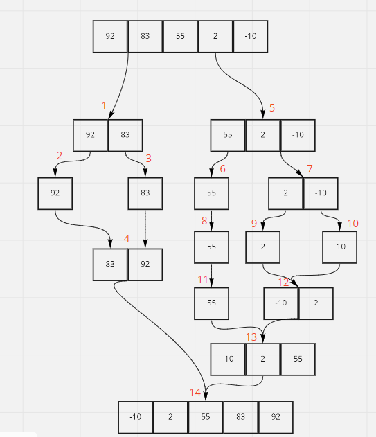

# Insertion Sort

In this forst loop I will start comparing between the first value and and it is next and I will save it's index to a variable called minn and I will loop over all values and check with the minn 

Here I will start from the second value in the list and repate the same

Here I will start from third value and do the same
## ------------------------------------------------------------------------------

# Merge Sort

Step 1: devide the list to left and right 

Step 2 & 3: devide the left half 

Step 4: sort the first half and merge them

Step 5: the right half

Step 6 & 8 & 11: the first half of the right half

step 7: the second half of the right half

Step 9 & 10: devide the second half of the right half

Step 12: sort the second half of the right half and merge them  

Step 13: sort the parts of the right half and merge them

Step 14: sort the parts of the origin list and merge them