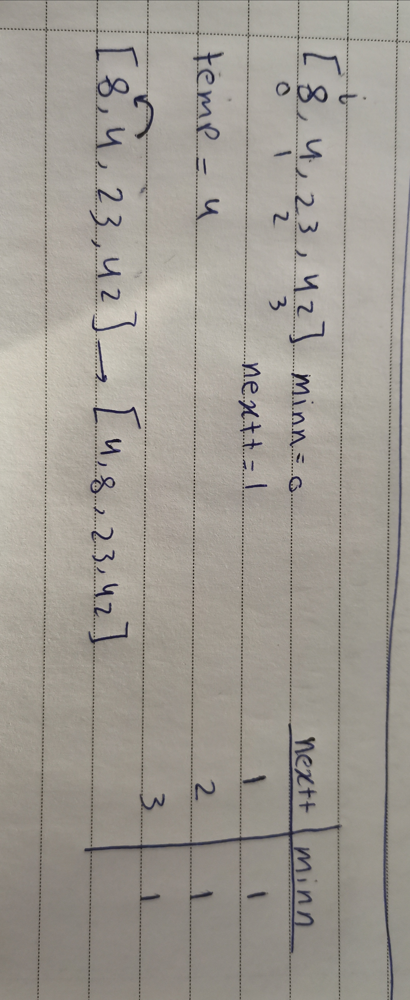
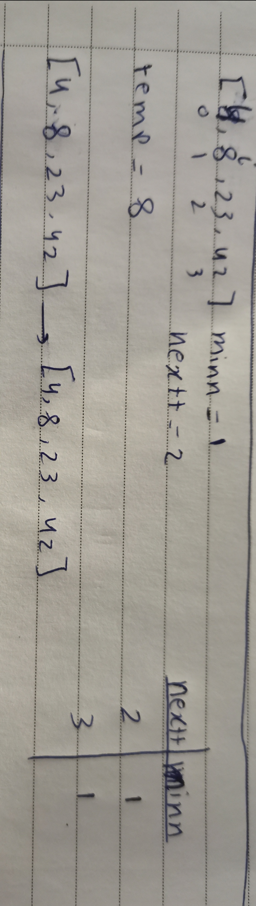
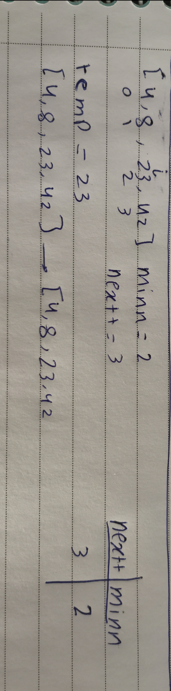

# Insertion Sort

In this forst loop I will start comparing between the first value and and it is next and I will save it's index to a variable called minn and I will loop over all values and check with the minn 

Here I will start from the second value in the list and repate the same

Here I will start from third value and do the same