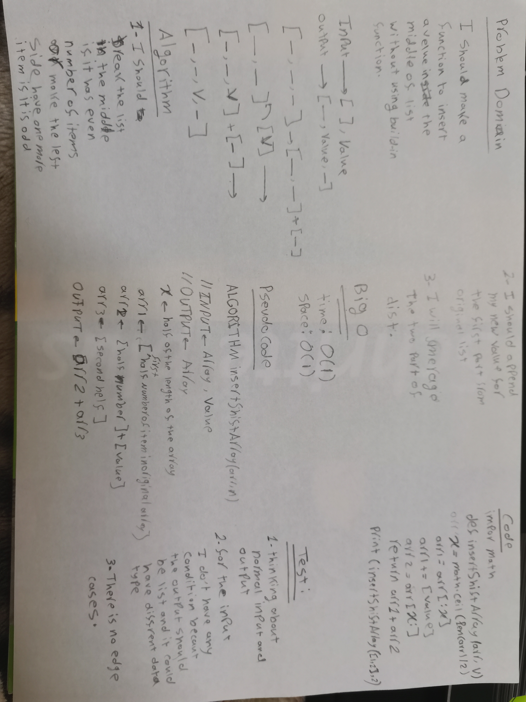

# Table of Contents 

|Challenge No. | Name of challenge|
|:---------: |:--------------:|
|1|[Reverse an Array](data_structures_and_algorithms/challenges/array_reverse/array_reverse.py)
|2|[Shift an Array](data_structures_and_algorithms/challenges/array_shift/array_shift.py)
|3|[Binary Search ](data_structures_and_algorithms/challenges/array_binary_search/array_binary_search.py)
|5|[Linked List ](data_structures_and_algorithms/data_structures/linked_list/linked_list.py)
|8|[ll-zip ](data_structures_and_algorithms/challenges/ll_zip/ll_zip.py)
|10|[Stack and Queue ](data_structures_and_algorithms/data_structures/stacks_and_queues/stacks_and_queues.py)
|11|[Queue using two Stacks ](data_structures_and_algorithms/challenges/queue_with_stacks/queue_with_stacks.py)
|12|[fifo_animal_shelter ](data_structures_and_algorithms/challenges/fifo_animal_shelter/fifo_animal_shelter.py)
|13|[Bracket Validation ](data_structures_and_algorithms/challenges/multi_bracket_validation/multi_bracket_validation.py)
|15|[Tree ](data_structures_and_algorithms/data_structures/tree/tree.py)
|18|[FizzBuzzTree ](data_structures_and_algorithms/challenges/fizz_buzz_tree/fizz_buzz_tree.py)
|26|[Insertion Sort ](data_structures_and_algorithms/challenges/insertion_sort/insertion_sort.py)
|27|[Merge Sort ](data_structures_and_algorithms/challenges/merge_sort/merge_sort.py)
|28|[Quick Sort ](data_structures_and_algorithms/challenges/quick_sort/quick_sort.py)
|30|[Hahstable ](data_structures_and_algorithms/data_structures/hashtable/hashtable.py)
|31|[Repeated Word ](data_structures_and_algorithms/challenges/repeated_word/repeated_word.py)
|32|[Tree Intersection ](data_structures_and_algorithms/challenges/tree_intersection/tree_intersection.py)
|33|[Left Join ](data_structures_and_algorithms/challenges/left_join/left_join.py)
|35|[Graph ](data_structures_and_algorithms/data_structures/graph/graph.py)

# Reverse an Array
<!-- Short summary or background information -->
I should creat a function which take one arrgument as list and retun a reverse list for it 

## Challenge
<!-- Description of the challenge -->
I should creat a function which take one arrgument as list and retun a reverse list for it 
## Approach & Efficiency
<!-- What approach did you take? Why? What is the Big O space/time for this approach? -->
I used on of index properety for lists to solve this challenge which is the shortest and easist way to solve it (O(1))
## Solution

# Shift an Array
<!-- Short summary or background information -->
I should creat a function which take two arrguments one is array and the second is value and return a new array have that value in the middle of it without using any build-in methods.
## Challenge Description
<!-- Description of the challenge -->
I should creat a function which take two arrguments one is array and the second is value and return a new array have that value in the middle of it without using any build-in methods.
## Approach & Efficiency
<!-- What approach did you take? Why? What is the Big O space/time for this approach? -->
I will split the array to two array  and append the new value the first part and then merage them again
## Solution
<!-- Embedded whiteboard image -->

# Binary Search 

<!-- Short summary or background information -->
I should creat a function take two arrguments sorted array and key value and return the index of value inside the array and equal the value of key and retirn -1 if it does not exsit.
## Challenge Description
<!-- Description of the challenge -->
I should creat a function take two arrguments sorted array and key value and return the index of value inside the array and equal the value of key and retirn -1 if it does not exsit.
## Approach & Efficiency
<!-- What approach did you take? Why? What is the Big O space/time for this approach? -->
I will compare between the mid value inside the array and the key then I will specify if it is in the left of right then compare with the middle of the half..etc
## Solution
<!-- Embedded whiteboard image -->

# Singly Linked List
<!-- Short summary or background information -->
A Linked List is a sequence of Nodes that are connected/linked to each other. The most defining feature of a Linked List is that each Node references the next Node in the link.

## Challenge
<!-- Description of the challenge -->
I should create a method to insert in the Head of a linked list and another method to find if the value exsist in the linked list and all of that without using any build-in method.

## Approach & Efficiency
<!-- What approach did you take? Why? What is the Big O space/time for this approach? -->
I used the classes to create a linked list or to insert a new value to it, in addition to find if a spsefic value exsist or not.
my class was O(1)

## API
<!-- Description of each method publicly available to your Linked List -->
For insert method I created a new Node and then assigned the head to the next value after that I but the head on my new Node.
For includes method I assigned the head to the current to make sure that i am starting from the beginning then I will loop over the content and return True if it exsist and False if it is not exsist.

# Linked list 
<!-- Short summary or background information -->
A Linked List is a sequence of Nodes that are connected/linked to each other. The most defining feature of a Linked List is that each Node references the next Node in the link.
## Challenge Description
<!-- Description of the challenge -->
I should to create three methods one to append in the end of the linked list and one to insert before a specific value and the last one to append after a specific value
## Approach & Efficiency
<!-- What approach did you take? Why? What is the Big O space/time for this approach? -->
For appending in the end I will loop over the list then I will stop on the last value in the list then add my new node

For inserting before a value I will loop over the linked list and I will stop on the previous target value and I will append the value of the node for its next value and pointing the new node to the target value.

for inserting after a value it the same of inserting before but insted of stoping on previous node I will stop on the target value

Big O for this is O(1)
## Solution
<!-- Embedded whiteboard image -->
https://miro.com/welcomeonboard/l6ziM3FAemgdqMsZHMqXmLMOaxUHJG3sooELkmBlW1O7qy8Q1vFKtaYi9EUmkEgi

# Linked list 
<!-- Short summary or background information -->
A Linked List is a sequence of Nodes that are connected/linked to each other. The most defining feature of a Linked List is that each Node references the next Node in the link.
## Challenge Description
<!-- Description of the challenge -->
I should to create a method take k as argument and return the value of the node that have k index but reverse 
## Approach & Efficiency
<!-- What approach did you take? Why? What is the Big O space/time for this approach? -->
I will loop over the list to get its length then I will subtract the k from the length then I will loop over the list until arrive to the node which have the subtraction value index

Big O for this is O(2n)
## Solution
<!-- Embedded whiteboard image -->
https://miro.com/welcomeonboard/1oPMXT0QE5fxxAfjJ8p3iVbJmp9TxWY8Q0DBrVWLIJKSi9NbGZts0xslegJOHV76

# ll-zip
<!-- Short summary or background information -->
It is ordring the lists item in new list 
## Challenge Description
<!-- Description of the challenge -->
Write a function called zipLists which takes two linked lists as arguments. Zip the two linked lists together into one so that the nodes alternate between the two lists and return a reference to the head of the zipped list.
## Approach & Efficiency
<!-- What approach did you take? Why? What is the Big O space/time for this approach? -->
Creating a new list and taking the items from another lists then returning anew list 
O(n) 
## Solution
<!-- Embedded whiteboard image -->
https://miro.com/welcomeonboard/Am0PG3pApIrnaozuwY3q5Ib68j55GtGJb84UrhqJlm2XhVhYcAgsf9XkIB0mlcFa

# Stacks and Queues
<!-- Short summary or background information -->
Stack and Queue is a data structure that consists of Nodes. Each Node references the next Node in the stack, but does not reference its previous.

## Challenge
<!-- Description of the challenge -->
For stack:
Create a Stack class that has a top property. It creates an empty Stack when instantiated.

This object should be aware of a default empty value assigned to top when the stack is created.

Define a method called push which takes any value as an argument and adds a new node with that value to the top of the stack with an O(1) Time performance.

Define a method called pop that does not take any argument, removes the node from the top of the stack, and returns the node’s value. Should raise exception when called on empty stack.

Define a method called peek that does not take an argument and returns the value of the node located on top of the stack, without removing it from the stack. Should raise exception when called on empty stack.

Define a method called isEmpty that takes no argument, and returns a boolean indicating whether or not the stack is empty.

For Queue:
Create a Queue class that has a front property. It creates an empty Queue when instantiated.

This object should be aware of a default empty value assigned to front when the queue is created.

Define a method called enqueue which takes any value as an argument and adds a new node with that value to the back of the queue with an O(1) Time performance.

Define a method called dequeue that does not take any argument, removes the node from the front of the queue, and returns the node’s value. Should raise exception when called on empty queue.

Define a method called peek that does not take an argument and returns the value of the node located in the front of the queue, without removing it from the queue. Should raise exception when called on empty queue.

Define a method called isEmpty that takes no argument, and returns a boolean indicating whether or not the queue is empty.

## Approach & Efficiency
<!-- What approach did you take? Why? What is the Big O space/time for this approach? -->
For stack every node pointing to the next node and the last one called the top which I can append any new node for it and put it as top. Big O is O(1)

For queue evry node pointing to the next node and the first node called front and last one called rear so I can easily enqueue and dequeue. Big O is O(1)
## API
<!-- Description of each method publicly available to your Stack and Queue-->
For stack:
push: it will push a node to the top of the stack.
pop: it will remove the the top of the stack and return its value
peek: it will return the value of the top without removing it from stack
is_empty : it will return a boolean telling you if the stack is empty 

For queue:
enqueue: it will push a node to the rear of the queue.
dequeue: it will remove the the front of the queue and return its value
peek: it will return the value of the front without removing it from queue
is_empty : it will return a boolean telling you if the queue is empty 

# Queue using two Stacks
<!-- Short summary or background information -->
Stack and Queue is a data structure that consists of Nodes. Each Node references the next Node in the stack, but does not reference its previous.
## Challenge Description
<!-- Description of the challenge -->
I should to create a class which have two stacks as inistances and it should have a enqueue method and dequeue method.
## Approach & Efficiency
<!-- What approach did you take? Why? What is the Big O space/time for this approach? -->
I will push the new items inside first stacks that for enqueue and for dequeue I will loop over first stack and pop all its item and push them inside the second stack.
Big O is O(n)
## Solution
<!-- Embedded whiteboard image -->
https://miro.com/welcomeonboard/To5rgivtB9nKE2Kmm5hAvs9q0o4gWUA8sLBIRjbibD2xPgWPzi06qxgo7CtdG1Cx

# fifo_animal_shelter
<!-- Short summary or background information -->
Stack and Queue is a data structure that consists of Nodes. Each Node references the next Node in the stack, but does not reference its previous.

## Challenge
<!-- Description of the challenge -->
Create a class called AnimalShelter which holds only dogs and cats. The shelter operates using a first-in, first-out approach.
## Approach & Efficiency
<!-- What approach did you take? Why? What is the Big O space/time for this approach? -->
I will check first item if it is like pref I will return it but if not I will loop to find it and take its value and skip it
## API
<!-- Description of each method publicly available to your Stack and Queue-->
enqueue will add a cat or dog inside the queue
dequeue will return the first cat or dog find it related to pref and if pref was None so it will return the first pet.

# Bracket Validation
<!-- Short summary or background information -->
Checking brackets is one of mort important checking in programming languages which can make uxpected errors or results
## Challenge Description
<!-- Description of the challenge -->
Write a function to validate the brackets
## Approach & Efficiency
<!-- What approach did you take? Why? What is the Big O space/time for this approach? -->
Loop over string and check if its an open brackets then push it to the stack else if it is close bracket get its index and then get the open bracket with same index and compare it with last value inside the stack
## Solution
<!-- Embedded whiteboard image -->
https://miro.com/welcomeonboard/hy0zRjyAtT0Ou3rLufOP7t4QLGwqd48lxu0f7tfxVYgAObUqctUIOfsdMQFjfLsS

# Trees
<!-- Short summary or background information -->
I am using here Binary Tree where each node have only two or less children

## Challenge
<!-- Description of the challenge -->
Crete two classes one to traverse during a tree and the second one to add and find a value
## Approach & Efficiency
<!-- What approach did you take? Why? What is the Big O space/time for this approach? -->
In this two classes I use recursion eather for traversing or for adding and checking 
the Big O for the two classes is log(n)
## API
<!-- Description of each method publicly available in each of your trees -->
I created a class called BinaryTree which travers during the tree with three methods preOrder(root ==> left ==> right) or inOrder(left ==> root ==> right) or postOrder(left ==> right ==> root)
There is another class called BinarySearchTree where you can use add() method to create your tree and if you want to chack if the tree have a spesific value you can use contains() method

# Find maximum value in a tree 
<!-- Short summary or background information -->
I am using here Binary Tree where each node have only two or less children
## Challenge Description
<!-- Description of the challenge -->
Write a function to return maximum value inside the tree
## Approach & Efficiency
<!-- What approach did you take? Why? What is the Big O space/time for this approach? -->
I used recursion using preorder method tho go thorght the tree and compare each value with a varibale where I gave it first time the root value and then it will change if it find larger data
## Solution
<!-- Embedded whiteboard image -->
https://miro.com/welcomeonboard/LN13ANWem6KOOvvRpJpAwiLJ31Gaf27cOs5E5h9sdQFFZ978Y0pzcEIpwGrfjGgo

# Breadth first search 
<!-- Short summary or background information -->
I am using here Binary Tree where each node have only two or less children
## Challenge Description
<!-- Description of the challenge -->
Write a breadth first traversal method which takes a Binary Tree as its unique input.
## Approach & Efficiency
<!-- What approach did you take? Why? What is the Big O space/time for this approach? -->
I used queue rules to enqueue the node every time and dequeue it 
Big O: O(n)
## Solution
<!-- Embedded whiteboard image -->
https://miro.com/welcomeonboard/cAXXlnEtMJ4jaOYO4vURfAUmSdUN7EREpUktDUcQKICAyXpG8OwIwMLX1YLNsiFZ

# Fizz Buzz Tree
<!-- Short summary or background information -->
- If the value is divisible by 3, replace the value with “Fizz”
- If the value is divisible by 5, replace the value with “Buzz”
- If the value is divisible by 3 and 5, replace the value with “FizzBuzz”
- If the value is not divisible by 3 or 5, simply turn the number into a String.
## Challenge Description
<!-- Description of the challenge -->
Write a function called FizzBuzzTree which takes a k-ary tree as an argument. And great new tree with fizz buzz rules
## Approach & Efficiency
<!-- What approach did you take? Why? What is the Big O space/time for this approach? -->
I used the preOrder to go throwght the tree and and get fuizz buzz values.
Big O: O(n)
## Solution
<!-- Embedded whiteboard image -->
https://miro.com/welcomeonboard/CU6RXpxmyFNGVzICbppFd8VhIww6TkYPbfuMhOXnkjI0HHKQeIJJRMvzLtEqo4A7

# Insertion Sort
<!-- Short summary or background information -->
It is the method that check the current value and next value 
## Challenge Description
<!-- Description of the challenge -->
Sorting a list ascending
## Approach & Efficiency
<!-- What approach did you take? Why? What is the Big O space/time for this approach? -->
1- looping over each value in array

2- check the next value for the current one

3- if the next value is less than the current value swap them 

big O:

time: O(2^n)

space = O(1)
## Solution
<!-- Embedded whiteboard image -->
https://miro.com/welcomeonboard/EkuehYRIyzPhKnh74FS7uImzcaackvyL7H5rxmmfRZqMcvrtK4Ow9fmCyI6hpHHZ

# Merge Sort
<!-- Short summary or background information -->
This method will devide the list until you have just tow or less elements then will sort the sublist
## Challenge Description
<!-- Description of the challenge -->
Write a function to sort a list using merge sort algorithm
## Approach & Efficiency
<!-- What approach did you take? Why? What is the Big O space/time for this approach? -->
1- Find the middle point to divide the array into two halves.

2- call the function again for the first half

3- call the function again for the second half

4- when you have an array with just tow elements or less sort it

5- Merge the halves with each others.

Big O:

time: O(nlogn)

space: O(1)
## Solution
<!-- Embedded whiteboard image -->
https://miro.com/welcomeonboard/klX1v2Sy6F7DjgY6lqutKldbjLL3j12ORCDvV7hWGj4BrpLYYxbUoh5npbhIHb0Y

# Quick Sort
<!-- Short summary or background information -->
This method will put last value in it is right position and put all values which are smaller than it in the left of it.
## Challenge Description
<!-- Description of the challenge -->
Write a function to sort a list using quick sort algorithm
## Approach & Efficiency
<!-- What approach did you take? Why? What is the Big O space/time for this approach? -->
1- declare a variable and make it equal to returning value from position function

2- define position function which will take a list and first index and final index and will put the last element in it's correct position and will out all values which are smaller than last value before it

3- recursive the quick sort function again

Big O:

time: O(nlogn)

space: O(1)
## Solution
<!-- Embedded whiteboard image -->
https://miro.com/welcomeonboard/KVqN9MkNLKV4ayDipPyaY6K45V4WUiEUvr4nAEcfXU8cKsKEGbc7s9axVpPe4dCK

# Hashtables
<!-- Short summary or background information -->
Hashing is a technique that is used to uniquely identify a specific object from a group of similar objects. Some examples of how hashing is used in our lives include:

- In universities, each student is assigned a unique roll number that can be used to retrieve information about them.
- In libraries, each book is assigned a unique number that can be used to determine information about the book, such as its exact position in the library or the users it has been issued to etc.
## Challenge
<!-- Description of the challenge -->
Implement a Hashtable with the following methods:

- add: takes in both the key and value. This method should hash the key, and add the key and value pair to the table, handling collisions as needed.
- get: takes in the key and returns the value from the table.
- contains: takes in the key and returns a boolean, indicating if the key exists in the table already.
- hash: takes in an arbitrary key and returns an index in the collection.
## Approach & Efficiency
<!-- What approach did you take? Why? What is the Big O space/time for this approach? -->
I will create a list but I will give the user an opportunity to chose it size for the position of the key/value pair I will find the sum of the ASCII code for all key's characters and I will multiply it by 11 and find the its mod for the size and then I will creat a Linked List object and added the pair as Linked Lisst object using this way I will solve the collision problem.
Big O:
Time: O(1).
space: O(1).
## API
<!-- Description of each method publicly available in each of your hashtable -->
Add method will take a key and value and add them to the map list as Linked List object.
Get method will take a key and return the key value.
Contains will take a key and will return a boolean indication if the key exists or not.

# Repeated Word
<!-- Short summary or background information -->
Search for the first rpeated word
## Challenge Description
<!-- Description of the challenge -->
Write a function that accepts a lengthy string parameter and return return the first word to occur more than once in that provided string.
## Approach & Efficiency
<!-- What approach did you take? Why? What is the Big O space/time for this approach? -->
1- I will use regex to get all words in the string as a list

2- I will loop over the list and compare the value with new list items

3- If it did not find any same word in the new list so it will append this word

Big O:

time: O(n^2)

space: O(1)
## Solution
<!-- Embedded whiteboard image -->
https://miro.com/welcomeonboard/fOC6d2DqlrIrJbegrh2GVCDT5bnv69kRSODe9OIkO480Pl43xuQZGH0twrMdMEcP

# Tree Intersection
<!-- Short summary or background information -->
Tree is type of data structure which has root and chaildren and the chaildren have chaildren until you arrive to leaf which does not has chaildren
## Challenge Description
<!-- Description of the challenge -->
Write a function called tree_intersection that takes two binary tree parameters and return a set of values found in both trees.

## Approach & Efficiency
<!-- What approach did you take? Why? What is the Big O space/time for this approach? -->
1- Traverse over the trees and append their items value to two lists one for each tree and change one of the lists to set

2- loop over the first list and compare each element with all elements in the second list

3- if you find any similar value append it to output list

4- return output list

Big O:

time: O(n)

space: O(1)

## Solution
<!-- Embedded whiteboard image -->
https://miro.com/welcomeonboard/qOIuuCJe55FhlfHOqMZBRNwQc4bPMjm1yMsNwMNxKKDRNfGVufykkiExOccnWthP

# Left Join
<!-- Short summary or background information -->
The SQL LEFT JOIN returns all rows from the left table, even if there are no matches in the right table. This means that if the ON clause matches 0 (zero) records in the right table; the join will still return a row in the result, but with NULL in each column from the right table.
## Challenge Description
<!-- Description of the challenge -->
Write a function that LEFT JOINs two hashmaps into a single data structure.

## Approach & Efficiency
<!-- What approach did you take? Why? What is the Big O space/time for this approach? -->
1- Loop over the first hashmap

2- declare a variable to save the key value

3- check if the key exist in the second hashmap and save it value

4- append the key and the two values

Big O:

time: O(n)

space: O(n)

## Solution
<!-- Embedded whiteboard image -->
https://miro.com/welcomeonboard/U31OYHjkBAJzHKtGZNB0Ar6EQfd7I3FQERHEm3bjcdg2Ih6FmOFi8L3dvnR8gwJd

# Graphs
<!-- Short summary or background information -->
A graph is a non-linear data structure that can be looked at as a collection of vertices (or nodes) potentially connected by line segments named edges.
## Challenge
<!-- Description of the challenge -->
The graph should be represented as an adjacency list, and should include the following methods:

AddNode()
- Adds a new node to the graph
- Takes in the value of that node
- Returns the added node
AddEdge()
- Adds a new edge between two nodes in the graph
- Include the ability to have a “weight”
- Takes in the two nodes to be connected by the edge
- - Both nodes should already be in the Graph
GetNodes()
- Returns all of the nodes in the graph as a collection (set, list, or similar)
GetNeighbors()
- Returns a collection of edges connected to the given node
- Takes in a given node
- Include the weight of the connection in the returned collection
Size()
- Returns the total number of nodes in the graph
## Approach & Efficiency
<!-- What approach did you take? Why? What is the Big O space/time for this approach? -->
I represent the graph as a dic and the key has a list of lists where the child list has two values the value of connected list and the weight of the edge

Big O:
Time: O(n^2)
Space: O(n)
## API
<!-- Description of each method publicly available in your Graph -->
AddNode()
- Adds a new node to the graph
- Takes in the value of that node
- Returns the added node
AddEdge()
- Adds a new edge between two nodes in the graph
- Include the ability to have a “weight”
- Takes in the two nodes to be connected by the edge
- - Both nodes should already be in the Graph
GetNodes()
- Returns all of the nodes in the graph as a collection (set, list, or similar)
GetNeighbors()
- Returns a collection of edges connected to the given node
- Takes in a given node
- Include the weight of the connection in the returned collection
Size()
- Returns the total number of nodes in the graph