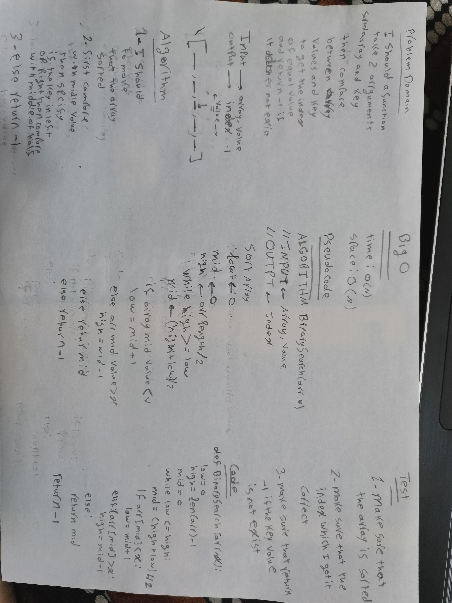

# Table of Contents 

|Challenge No. | Name of challenge|
|:---------: |:--------------:|
|1|[Reverse an Array](data_structures_and_algorithms/challenges/array_reverse/array_reverse.py)
|2|[Shift an Array](data_structures_and_algorithms/challenges/array_shift/array_shift.py)
|3|[Binary Search ](data_structures_and_algorithms/challenges/array_binary_search/array_binary_search.py)
|5|[Linked List ](data_structures_and_algorithms/data_structures/linked_list/linked_list.py)
|8|[ll-zip ](data_structures_and_algorithms/challenges/ll_zip/ll_zip.py)

# Reverse an Array
<!-- Short summary or background information -->
I should creat a function which take one arrgument as list and retun a reverse list for it 

## Challenge
<!-- Description of the challenge -->
I should creat a function which take one arrgument as list and retun a reverse list for it 
## Approach & Efficiency
<!-- What approach did you take? Why? What is the Big O space/time for this approach? -->
I used on of index properety for lists to solve this challenge which is the shortest and easist way to solve it (O(1))
## Solution

# Shift an Array
<!-- Short summary or background information -->
I should creat a function which take two arrguments one is array and the second is value and return a new array have that value in the middle of it without using any build-in methods.
## Challenge Description
<!-- Description of the challenge -->
I should creat a function which take two arrguments one is array and the second is value and return a new array have that value in the middle of it without using any build-in methods.
## Approach & Efficiency
<!-- What approach did you take? Why? What is the Big O space/time for this approach? -->
I will split the array to two array  and append the new value the first part and then merage them again
## Solution
<!-- Embedded whiteboard image -->

# Binary Search 

<!-- Short summary or background information -->
I should creat a function take two arrguments sorted array and key value and return the index of value inside the array and equal the value of key and retirn -1 if it does not exsit.
## Challenge Description
<!-- Description of the challenge -->
I should creat a function take two arrguments sorted array and key value and return the index of value inside the array and equal the value of key and retirn -1 if it does not exsit.
## Approach & Efficiency
<!-- What approach did you take? Why? What is the Big O space/time for this approach? -->
I will compare between the mid value inside the array and the key then I will specify if it is in the left of right then compare with the middle of the half..etc
## Solution
<!-- Embedded whiteboard image -->

# Singly Linked List
<!-- Short summary or background information -->
A Linked List is a sequence of Nodes that are connected/linked to each other. The most defining feature of a Linked List is that each Node references the next Node in the link.

## Challenge
<!-- Description of the challenge -->
I should create a method to insert in the Head of a linked list and another method to find if the value exsist in the linked list and all of that without using any build-in method.

## Approach & Efficiency
<!-- What approach did you take? Why? What is the Big O space/time for this approach? -->
I used the classes to create a linked list or to insert a new value to it, in addition to find if a spsefic value exsist or not.
my class was O(1)

## API
<!-- Description of each method publicly available to your Linked List -->
For insert method I created a new Node and then assigned the head to the next value after that I but the head on my new Node.
For includes method I assigned the head to the current to make sure that i am starting from the beginning then I will loop over the content and return True if it exsist and False if it is not exsist.

# Linked list 
<!-- Short summary or background information -->
A Linked List is a sequence of Nodes that are connected/linked to each other. The most defining feature of a Linked List is that each Node references the next Node in the link.
## Challenge Description
<!-- Description of the challenge -->
I should to create three methods one to append in the end of the linked list and one to insert before a specific value and the last one to append after a specific value
## Approach & Efficiency
<!-- What approach did you take? Why? What is the Big O space/time for this approach? -->
For appending in the end I will loop over the list then I will stop on the last value in the list then add my new node

For inserting before a value I will loop over the linked list and I will stop on the previous target value and I will append the value of the node for its next value and pointing the new node to the target value.

for inserting after a value it the same of inserting before but insted of stoping on previous node I will stop on the target value

Big O for this is O(1)
## Solution
<!-- Embedded whiteboard image -->
https://miro.com/welcomeonboard/l6ziM3FAemgdqMsZHMqXmLMOaxUHJG3sooELkmBlW1O7qy8Q1vFKtaYi9EUmkEgi

# Linked list 
<!-- Short summary or background information -->
A Linked List is a sequence of Nodes that are connected/linked to each other. The most defining feature of a Linked List is that each Node references the next Node in the link.
## Challenge Description
<!-- Description of the challenge -->
I should to create a method take k as argument and return the value of the node that have k index but reverse 
## Approach & Efficiency
<!-- What approach did you take? Why? What is the Big O space/time for this approach? -->
I will loop over the list to get its length then I will subtract the k from the length then I will loop over the list until arrive to the node which have the subtraction value index

Big O for this is O(2n)
## Solution
<!-- Embedded whiteboard image -->
https://miro.com/welcomeonboard/1oPMXT0QE5fxxAfjJ8p3iVbJmp9TxWY8Q0DBrVWLIJKSi9NbGZts0xslegJOHV76

# ll-zip
<!-- Short summary or background information -->
It is ordring the lists item in new list 
## Challenge Description
<!-- Description of the challenge -->
Write a function called zipLists which takes two linked lists as arguments. Zip the two linked lists together into one so that the nodes alternate between the two lists and return a reference to the head of the zipped list.
## Approach & Efficiency
<!-- What approach did you take? Why? What is the Big O space/time for this approach? -->
Creating a new list and taking the items from another lists then returning anew list 
O(n) 
## Solution
<!-- Embedded whiteboard image -->
https://miro.com/welcomeonboard/Am0PG3pApIrnaozuwY3q5Ib68j55GtGJb84UrhqJlm2XhVhYcAgsf9XkIB0mlcFa

